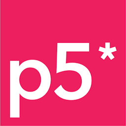
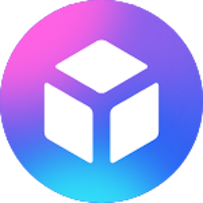
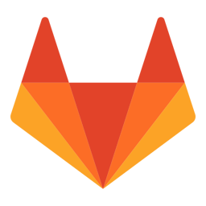
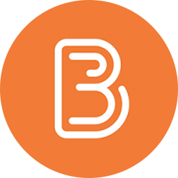
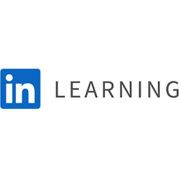

# PLATFORMER GAME - CO-OP PROJECT

Welkom bij het tweede project van HBO-ICT Game Development! Level Up Labs geeft jullie de opdracht om samen met een andere developer een nieuw uitdaging aan te gaan: het maken van een Platformer game! 

Ready to level up? 

    

## DOEL
Tijdens het tweede project ontwerp en ontwikkel je een videogame die is geïnspireerd op ouderwetse **Retro Platformer Games**. Denk aan games zoals Hollow Knight, Ori and the Blind Forest, Castlevania, Metroid, Mega Man, Sonic of Super Mario Bros. Echter geven jullie er je eigen, moderne twist aan, en zorg je voor een authentieke game-ervaring. Tijdens de ontwikkeling van het spel werk je **samen met een andere ontwikkelaar**. Het is tevens de eerste keer dat je actief aan de slag gaat met **design methoden en technieken**. 

## WAAROM
Je reis gaat verder! Je hebt de basis van het programmeren onder de knie, dus nu is het tijd dat je een videogame maakt vanuit je eigen verbeelding. Door te concentreren op platformer gameplay, kan je nieuwe dingen leren over het ontwerpen en ontwikkelen van games, terwijl je je laat inspireren door games die eerder zijn gemaakt. Het is echter wel belangrijk dat jullie als duo er een eigen twist aan geven, en niet een kloon maken van een bestaande game. De game design uitdagingen werpen zich nu dus op. Een platformer game is de perfecte game om je kennis te laten maken met de basisprincipes van het ontwerpen van videogames. 

## WAT

### Game technologie methoden en technieken zoals:
- Git Versiebeheer
- Object Georiënteerd Programmeren (OOP)
- Databases 
- UML

### Game & UX Design methoden en technieken zoals: 
- Inspiration Analysis 
- Formal Elements 
- MDA Framework 
- Level Design 
- Sketching & Paper Prototyping 
- Testing 

### Agile methoden en technieken zoals: 
- Daily Stand-up 
- Product Backlog 
- Sprint Backlog 
- User Stories 
- Sprint Product Review 
- Sprint Retrospective 

## PRODUCTEN 
Tijdens dit project kom je in aanraking met een aantal concepten en producten die je gebruikt om verder te komen: 

- Paper & Digital Prototypes
- Tech Demos 
- Game Design uitwerkingen 
- Testrapporten 
- Retrospective uitwerkingen 
- Sprint Boards 
- Final Game 

## TOOLS EN TECHNIEKEN
We werken met een aantal tools en technieken die je helpen bekend te raken met de opleiding en de manier van werken.
Deze tools en technieken staan hieronder uitgeschreven.

| 

 | 

 | 

 | 
| --------------------------------------- | ------------------------------------- | ------------------------------------- |
| P5 JS | Visual Studio Code | Scorion |
| P5JS is een educatieve JavaScript library die het makkelijk maakt snel games te bouwen. Dit blok werken we in Visual Studio Code en niet in de online editor. | Dit blok gebruiken we VS Code, omdat het een geavanceerdere ontwikkelomgeving is, waar meer mogelijk is dan in de browser.  | Scorion gebruik je om je voortgang mee vast te leggen en hier houd je de feedback van docenten, studentmentoren en medestudenten bij. |
| 

 | 

 | 

 | 
| Gitlab | Microsoft Teams | DLO |
| Gitlab wordt gebruikt als planning tool en je zal hier later je code gaan bijhouden. | MS Teams wordt gebruikt voor communicatie en samenwerking. Wanneer een docent ziek is en er niet kan zijn, zal dit hier worden vermeld. | DLO is onze digitale leeromgeving. Hier vind je je leermateriaal. Bovendien zie je hier snel wat je nog moet doen om het blok te halen. |
| 

 | | |
| LinkedIn Learning | | |
| Op LinkedIn Learning staan cursussen voor o.a. programmeren en game development. |

Veel succes met het bouwen van jullie tweede game en veel plezier met het ontdekken van de wereld van game development! 